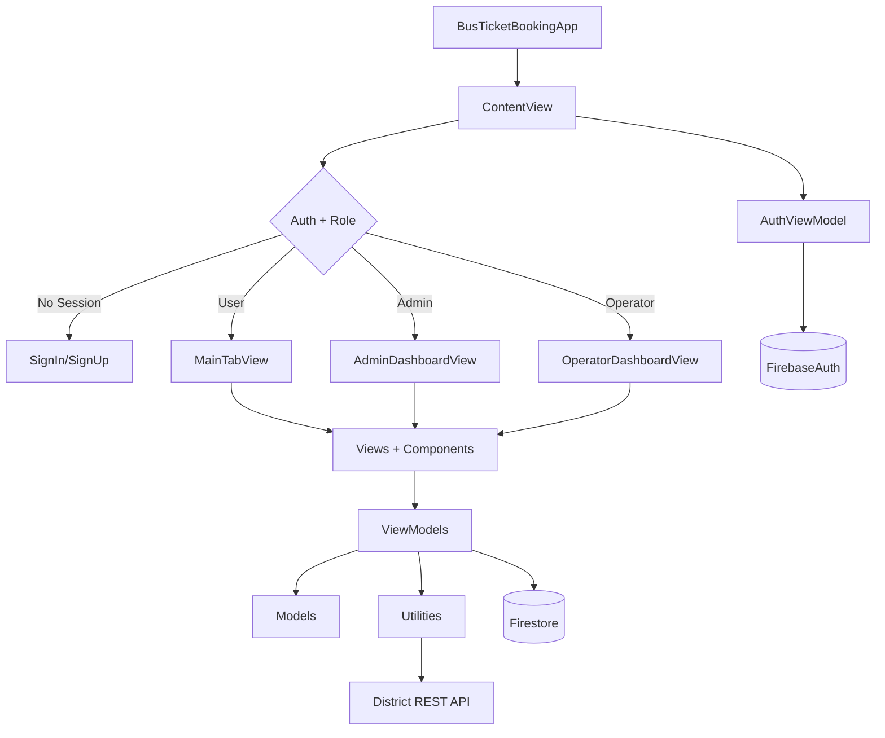
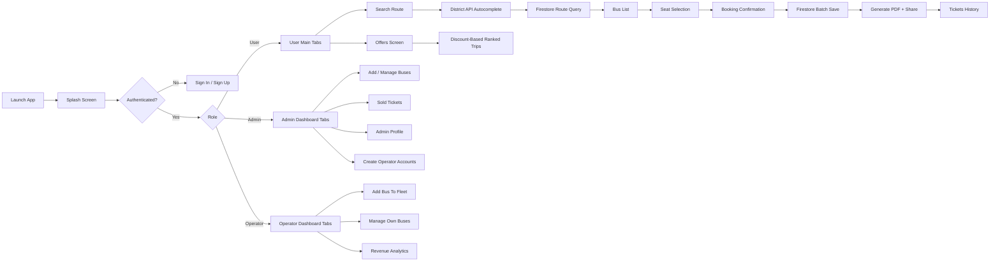
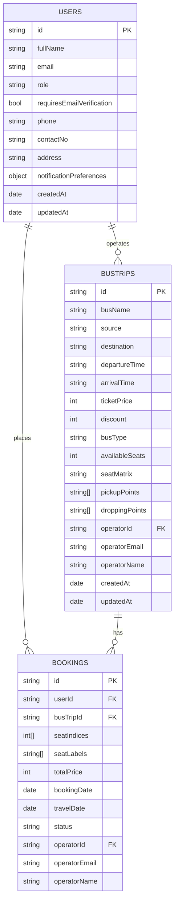
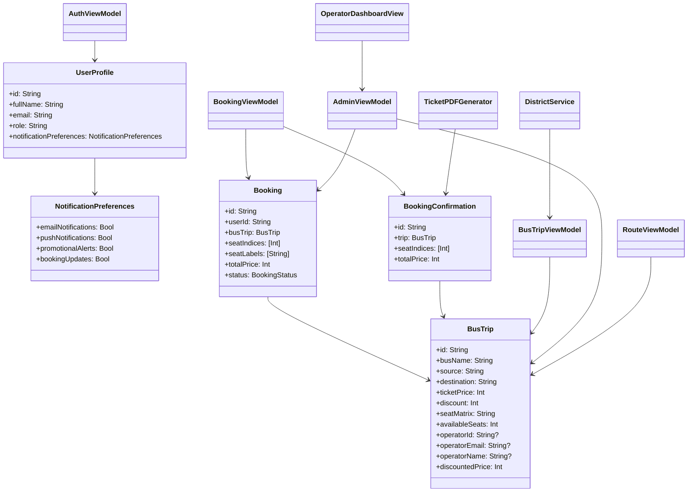
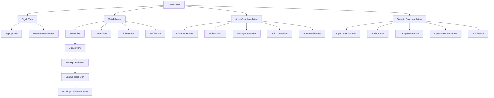

# Bus Ticket Booking App

Role-based iOS bus ticket booking application built with SwiftUI, Firebase Authentication, and Cloud Firestore.

## Overview

- Platform: iOS (SwiftUI)
- Pattern: MVVM (requested as MVVC in prompt; implemented as MVVM in code)
- Backend: Firebase Authentication + Firestore
- Key domains: route discovery, seat booking, ticket lifecycle, offers, admin oversight, operator fleet/revenue operations
- Entry flow: Splash -> Auth gate -> User tabs or Admin tabs or Operator tabs

## Architecture



### Layer responsibilities

- Views/Components: Render UI and bind state.
- ViewModels: Business logic, validation, network/database orchestration.
- Models: Domain data structures and decoding.
- Utilities: PDF generation and district API integration.
- Firebase: Auth state + persistent cloud data.

## Workflow Of App



## Role Based Work

### User role

- Register/login with email/password.
- Verify email before normal login.
- Search buses by source and destination.
- Select seats from live seat matrix.
- Confirm booking and persist ticket.
- Download/share PDF ticket.
- View tickets and cancel ticket.
- Edit profile and notification preferences.

### Admin role

- Access admin-only dashboard tabs.
- Add new bus trips with route, pricing, stops.
- Manage bus inventory (view/delete).
- View sold tickets with passenger + trip details.
- Monitor top-level statistics (buses, users, bookings, routes).
- Create operator accounts and monitor operator performance.

### Operator role

- Sign in using operator account created by admin.
- Add buses and automatically tag them with operator ownership.
- Manage only operator-owned buses.
- View operator dashboard overview.
- Monitor revenue, daily breakdown, bus-wise revenue, and recent transactions.

## Access Matrix For Roles

| Feature | User | Admin | Operator |
|---|---|---|---|
| Sign in / sign up | Yes | Yes | Sign in only |
| Email verification flow | Required | Not required | Not required |
| Search route and buses | Yes | Optional | Optional |
| Offers browsing | Yes | Optional | Optional |
| Seat selection and booking | Yes | Optional | Optional |
| Download/share ticket PDF | Yes | Optional | Optional |
| View/cancel own tickets | Yes | Optional | Optional |
| Edit profile | Yes | Yes | Yes |
| Notification preferences | Yes | No | Yes |
| Admin dashboard | No | Yes | No |
| Create operator accounts | No | Yes | No |
| Add bus | No | Yes | Yes |
| Manage buses | No | Yes (all) | Yes (own fleet only) |
| Revenue analytics | No | Yes (global) | Yes (own fleet only) |
| View sold tickets | No | Yes | No |

## Core Functionality

- Authentication and profile lifecycle with Firestore-backed user document.
- API-assisted route input and Firestore-backed route search.
- Seat matrix booking model (`40` seats, binary matrix string).
- Atomic booking write using Firestore batch operation.
- Booking cancellation flow with seat release.
- Offer listing for discounted trips with best-discount-first ranking.
- PDF ticket generation (details page + seat layout page).
- In-app notification scheduling after successful booking confirmation.
- Operator account creation, operator-scoped fleet management, and revenue analytics.

## Offer Feature Spotlight

- Dedicated `Offers` tab surfaces discounted buses from Firestore.
- Query strategy: fetch `busTrips` where `discount > 0`.
- Ranking strategy:
	- Higher discount first.
	- If equal discount, lower discounted fare first.
- UI clearly shows original fare, discount percentage, and discounted fare.
- Supports navigation into full trip details directly from offer cards.

## Database Structure (Firestore)

### Collection: users

- id (document id = uid)
- fullName
- email
- phone
- contactNo
- address
- role (`user` or `admin`)
- role (`user` or `admin` or `operator`)
- requiresEmailVerification (used for operator/admin style access policy)
- notificationPreferences:
	- emailNotifications
	- pushNotifications
	- promotionalAlerts
	- bookingUpdates
- createdAt
- updatedAt

### Collection: busTrips

- busName
- source
- destination
- departureTime
- arrivalTime
- ticketPrice
- discount
- busType
- availableSeats
- seatMatrix (40-char binary string)
- pickupPoints (array)
- droppingPoints (array)
- operatorId (nullable)
- operatorEmail (nullable)
- operatorName (nullable)
- createdAt
- updatedAt

### Collection: bookings

- userId (ref key)
- busTripId (ref key)
- seatIndices (array of Int)
- seatLabels (array of String)
- totalPrice
- bookingDate
- travelDate
- status (`confirmed` / `cancelled`)
- operatorId (denormalized for operator analytics)
- operatorEmail (optional denormalized)
- operatorName (optional denormalized)

## ER Diagram



## Class Diagram



## View Flow



## How MVVM (MVVC) Works In This Project

- Model:
	- Domain entities such as `BusTrip`, `Booking`, `UserProfile`.
	- Include role flags, operator ownership, decoding, and computed values (discounted price, duration, seat helpers).
- View:
	- SwiftUI screens in `Views/` and reusable units in `Components/`.
	- Bind to observable state from ViewModels.
- ViewModel:
	- `AuthViewModel`: auth/session/profile/role decisions.
	- `BusTripViewModel`: route search and offer retrieval.
	- `BookingViewModel`: booking create/read/cancel flow.
	- `AdminViewModel`: admin + operator data operations (CRUD, stats, operator accounts, revenue).
	- `RouteViewModel`: popular route aggregation.

State travels from ViewModel (`@Published`) to View via bindings and environment injection (`@EnvironmentObject`). User actions in View call ViewModel methods, then updated state redraws UI.

## Application Of State Management

- `@StateObject`: owns long-lived view-scoped ViewModels (Home, Offers, Tickets, etc.).
- `@EnvironmentObject`: shared auth/session state across app (`AuthViewModel`).
- `@Published`: exposes reactive mutable properties in all ViewModels.
- `@State`: local UI state such as selected seats, form text, navigation booleans.
- `@AppStorage`: persisted appearance preference (`isDarkMode`).
- `@MainActor`: UI-safe async state mutation in ViewModels.

## Application Of JSON And API

### External API use

- District data is fetched from:
	- `https://bdapis.vercel.app/geo/v2.0/districts` (primary)
	- `https://bdapi.vercel.app/api/v.1/district` (fallback)
- `DistrictService` uses `URLSession` + `JSONDecoder` and maps decoded payload into `District` models.

### Route search with API call (detailed)

- Step 1: `HomeView` loads district data through `DistrictService.fetchDistricts()`.
- Step 2: `DistrictAutocompleteField` filters API-returned district names for user-friendly route selection.
- Step 3: user picks `From` and `To` districts from this API-fed list.
- Step 4: `BusTripViewModel.fetchTrips(from:to:)` queries Firestore for exact `source` and `destination` matches.
- Step 5: results are sorted by fare client-side and shown in `BusListView`.

This makes route search API-assisted for input accuracy and Firestore-backed for availability and pricing.

### JSON-like Firestore document handling

- Firestore documents are read as `[String: Any]` and converted into typed models via custom initializers.
- Robust decoding paths handle int/string/number/timestamp variations.
- Example persisted structures include nested object `notificationPreferences` and array fields like `seatIndices`, `pickupPoints`, `droppingPoints`.

## Booking Data Workflow

- User selects seats from `SeatSelectionView`.
- Preview shown in `BookingConfirmationView`.
- `BookingViewModel.bookSeats(...)` performs atomic Firestore batch:
	- Update `busTrips.seatMatrix` and `availableSeats`.
	- Insert new booking document in `bookings`.
- On success, ticket PDF is generated and share/download flow is enabled.

## Project Structure

```text
BusTicketBooking/
	BusTicketBookingApp.swift      # App entry + FirebaseApp.configure()
	ContentView.swift              # Splash + auth/role routing
	MainTabView.swift              # User tab container
	Views/OperatorDashboardView.swift   # Operator dashboard and revenue screens
	Views/CreateOperatorSheet.swift     # Admin flow to create operator accounts
	Components/                    # Reusable UI parts
	Models/                        # Domain models + helper structs
	Utilities/                     # API + PDF utility services
	ViewModels/                    # Business logic/state orchestrators
	Views/                         # User/Admin screens

BusTicketBookingTests/           # Unit tests
BusTicketBookingUITests/         # UI tests
BusTicketBooking.xcodeproj/      # Xcode project metadata
```

## Setup

### Prerequisites

- macOS + Xcode (latest stable recommended)
- Apple simulator/device target
- Firebase project configured for iOS
- Valid `GoogleService-Info.plist` in app target

### Steps

1. Open `BusTicketBooking.xcodeproj` in Xcode.
2. Select the `BusTicketBooking` scheme.
3. Ensure Firebase Authentication and Firestore are enabled in Firebase Console.
4. Build and run on simulator/device.
5. Create test users and bus trips in Firestore (or use admin tools in app).

## Setup Notes For Firestore

- Collections expected by app: `users`, `busTrips`, `bookings`.
- Role values expected: `user`, `admin`, `operator`.
- Missing index scenarios are partially handled by client fallback logic.
- Ensure Firestore security rules allow required reads/writes per role.

## Highlights And Limitations

- Seat layout uses a deterministic 40-seat matrix (`0` available, `1` booked).
- Admin includes default account bootstrap path (`admin@gmail.com`) plus role-based checks.
- Operator accounts are created by admin and can sign in without email verification.
- Payment gateway is not integrated; booking confirmation currently acts as final action.

## Project Team

Project done by:

- Kazi Rifat Al Muin (Roll: 2107042)
- Abir Mahmud Talukdar (Roll: 2107049)
- Abdullah Md. Shahporan (Roll: 2107056)
